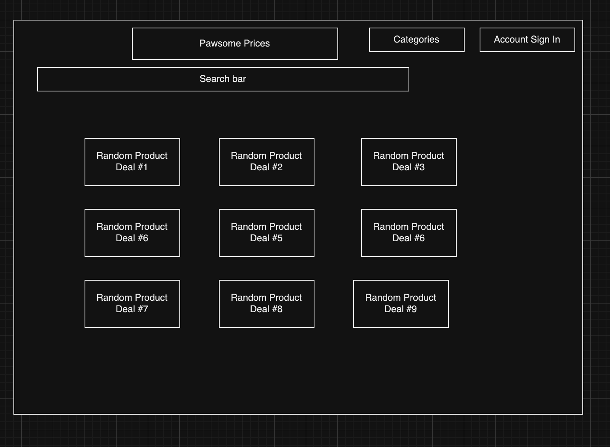
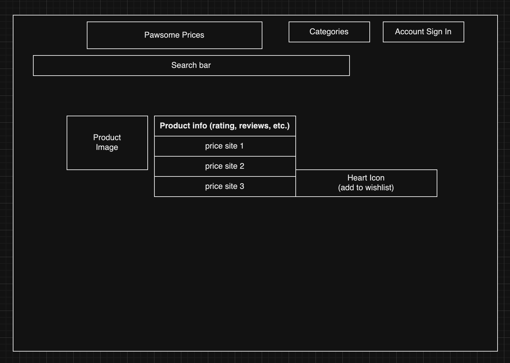

# Product Personas and Stories

## Team Theta

Table of Contents

- [Product Definition](#product-definition)
- [Vision Statement](#vision-statement)
- [Product Personas](#product-personas)
- [Product Scenarios](#product-scenarios)
- [User Stories](#user-stories)
- [User Experience](#user-experience)

## Product Definition

**Pawsome Prices**; will offer links to pet products across multiple different online storefronts so that the user can choose the one with the best price.

## Vision Statement

FOR pet owners WHO want to save time and money on pet products, Pawsome Prices is a site/app THAT will compare prices for products that users can search for, saving them time and money to get the best deal. UNLIKE similar sites that search for all products, OUR PRODUCT focuses on the specific niche, pet products, and will make it more convenient for users who are searching for products in this area, saving them time and money.

## Product Personas

- **Persona 1**: Exotic pet owner who has trouble finding their pet food or medicine at common stores and needs to pay a lot of money for them online.
- **Persona 2**: Pet owner who has a list of things they regularly have to buy, but they are all at different websites.
- **Persona 3**: Website manager who needs to create pages for every item.
- **Persona 4**: Single working parent who does not have time to run around to a lot of different stores and would rather buy online.

## Product Scenarios

### Product Scenario 1
**Website Administrator** wants to display highly visited items on the front page of the website in order to increase traffic to those popular items, making more profit from affiliate links.

**Louie**, who owns a bearded dragon, does not know where to get the cheapest crickets to feed it, and spends a lot of time searching on sites like Amazon and Walmart to compare the prices. He visits Pawsome Prices and searches for crickets, then chooses the cheapest one, leading to a link to Amazon. 

**Roger Sampson** has bought 3 cat towers for his Siamese cat Henrietta in the past year. Henrietta always manages to destroy the tower after a short time. Roger is tired of spending money on things that are going to break but he knows that Henrietta needs this tower to feel comfortable at home. Roger wants to buy another cat tower for as little money as possible, knowing that he'll need to replace it soon. He adds the tower that his cat likes to his wishlist and buys it from the cheapest website listed on Pawsome Prices.

## User Stories

### Feature1: Home page
**Description**

- As a user, I would like to use a search bar so that I can find specific pet products.
- As a user, I would like to see a search results page with previews of relevant products so that I can narrow down my search.
- As a site administrator, I want to display popular items to a section on the home page so I can increase site traffic to popular affiliate links.
- As a site administrator, I want to display heavily discounted items to a section on the home page so I can attract user traffic to good deals.

**Constraints**

- The amount of items we can reasonably include in our marketplace will be limited compared to a fully-fledged storefront due to time.
- In a real scenario, someone would need to manage the site.
**Comments**
- The site may only have 10 or so items depending on time constraints for the sake of showing off the concept.

### Feature2: Account

**Description**

- As a user, I want to sign up with my username, email, and password so I can receive benefits of becoming a site member.
- As a user, I want to add products to the wishlist tied to my account so I can track wanted or frequently bought items.
- As a user, I want to be notified when products on my wishlist go on sale so I can get the best prices while they are available.
- As a user, I want to be able to change my email address so my information is accurate.
- As a user, I want to be able to change my password so my account is secure.

**Constraints**
- Depending on the time we have, we may not be able to implement a fully secure account system.

**Comments**
- The main reason someone has an account is to track a wishlist of items and receieve notifications on deals. They do not need payment info.

### Feature3: Product Pages

**Description**

- As a user, I would like to see basic information and images on each product page so I can understand what product I am clicking the link to.
- As a user, I would like to be able to click links to sites that sell products on the page so I can purchase them there.
- As a user, I would like to see the price history of a product so I can see if it is a good deal at the present time.
- As a user, I would like to add a product to my wishlist from the product page so I can easy access it if it goes on sale.

**Constraints**
- The price history might be difficult to implement if we do not have time.
- For a prototype, we will not be able to make an actual affiliate account on sites like Amazon so we will just need to use regular links with the knowledge that a for-profit site would use affiliate links.
**Comments**
- Each product page will be added manually, so we will have to find things on our own to add to our store. We will not scrape the entire pets sections of sites like Amazon.
- Users will not purchase from the site, we only show prices and basic info with links to other sites so users can make informed decisions.

### Feature4: Administrator Panel

**Description**

- As an administrator, I would like to see statistics about which pages users are visiting so I can promote popular ones and increase site traffic.
- As an administrator, I want to be able to add and delete product pages so I can maintain and expand the site.
- As an administrator, I want to be able to edit information on product pages so I can keep every page and link accurate.

**Constraints**
- For the administrator tools, we need to come up with a product page template so that someone can easily add database items by filling in blanks and linking images.
- How fully-featured this feature is will depend on the time we have.
**Comments**
- In this project, we are the site administrators.

## User Experience

  Dashboard: 

  Search Results: 
  
  Example Product Page: 

  Wishlist page: 
