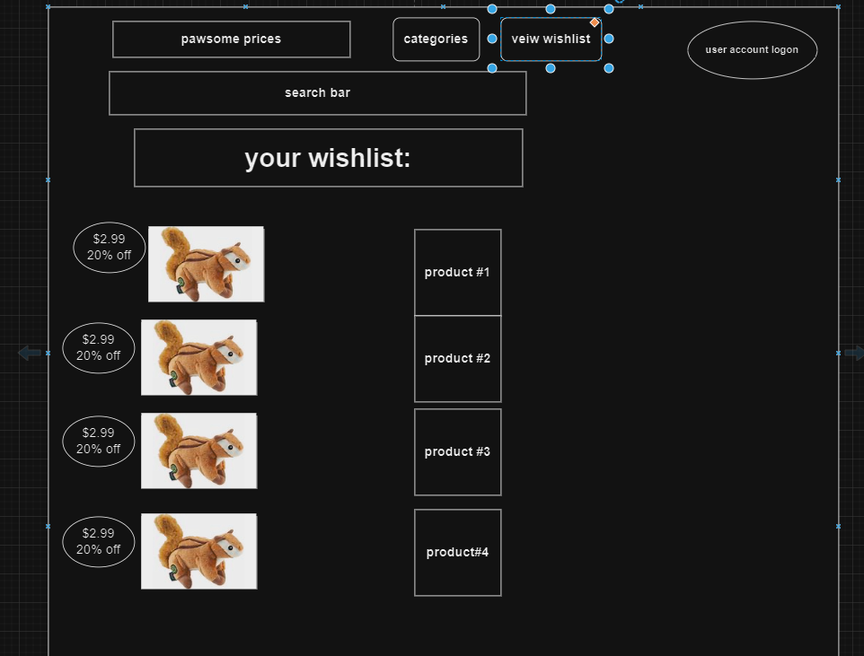

# Product Personas and Stories

## Team Theta

Table of Contents

- [Product Definition](#product-definition)
- [Vision Statement](#vision-statement)
- [Product Personas](#product-personas)
- [Product Scenarios](#product-scenarios)
- [User Stories](#user-stories)
- [User Experience](#user-experience)

## Product Definition

**Pawsome Prices**; will offer links to pet products across multiple different online storefronts so that the user can choose the one with the best price.

## Vision Statement

FOR pet owners WHO want to save time and money on pet products, Pawsome Prices is a site/app THAT will compare prices for products that users can search for, saving them time and money to get the best deal. UNLIKE similar sites that search for all products, OUR PRODUCT focuses on the specific niche, pet products, and will make it more convenient for users who are searching for products in this area, saving them time and money.

## Product Personas

- **Persona 1**: Exotic pet owner who has trouble finding their pet food or medicine at common stores and needs to pay a lot of money for them online.
- **Persona 2**: Pet owner who has a list of things they regularly have to buy, but they are all at different websites.
- **Persona 3**: Website manager who needs to create pages for every item.
- **Persona 4**: Single working parent who does not have time to run around to a lot of different stores and would rather buy online.

## Product Scenarios

### Product Scenario 1
**Website Administrator** wants to display highly visited items on the front page of the website in order to increase traffic to those popular items, making more profit from affiliate links.

**Louie**, who owns a bearded dragon, does not know where to get the cheapest crickets to feed it, and spends a lot of time searching on sites like Amazon and Walmart to compare the prices. He visits Pawsome Prices and searches for crickets, then chooses the cheapest one, leading to a link to Amazon. 

**Roger Sampson** has bought 3 cat towers for his Siamese cat Henrietta in the past year. Henrietta always manages to destroy the tower after a short time. Roger is tired of spending money on things that are going to break but he knows that Henrietta needs this tower to feel comfortable at home. Roger wants to buy another cat tower for as little money as possible, knowing that he'll need to replace it soon. He adds the tower that his cat likes to his wishlist and buys it from the cheapest website listed on Pawsome Prices.

## User Stories

### Feature1: Home page

**Description**

- As a user, I would like to use a search bar.
- As a manager, I want to create a list of popular products and display them on the home page
- As a manager, I want to create a list of products with heavy disounts and display them on the home page
- As a user, I want to be able to shop by animal, brand, or product type.

**Constraints**

Authentication from the SaaS application requires verification through the client’s authentication protocol or through our authentication mechanism.

**Comments**

- All users will authenticate through a single page and will be routed to the appropriate instance based on access policies setup by instance administrators.
- Users may only set up an account through invitation from instance administrators.

### Feature2: Account

**Description**

- As a user, I want to sign up with my username, email, and password
- As a user, I want to add products to the wishlist tied to my account
- As a user, I want to be notified when products on my wishlist go on sale.
- As a user, I want to be able to change my email address.
- As a user, I want to be able to change my password.
- As a site manager, I want to be able to lock problematic user accounts.

**Constraints**

Dashboard must only share tenant-specific statistics.

### Feature3: Product Pages

**Description**

- As a user, I would like to see information and images of products on each page, such as what animals each product is for and what category of product I am looking at.
- As a user, I would like to be able to click links to sites that sell products on the page.
- As a user, I would like to see the price history of a product.
- As a user, I would like to add a product to my wishlist.

**Constraints**

Sharing/assigning networks to colleagues is limited to those within the tenant instance.

### Feature4: Administrator Panel

**Description**

- As an administrator, I would like to see statistics about which pages users are visiting
- As an administrator, I want to be able to add and delete product pages.

**Constraints**

Limited to the tenant's instance.

## User Experience

Describe the user interface for your product.

- [Insert simple wireframes of your product—what will it look like from a user interface perspective]

  Dashboard: 

  Search Results: 
  
  Example Product Page: 

  Wishlist page: 
